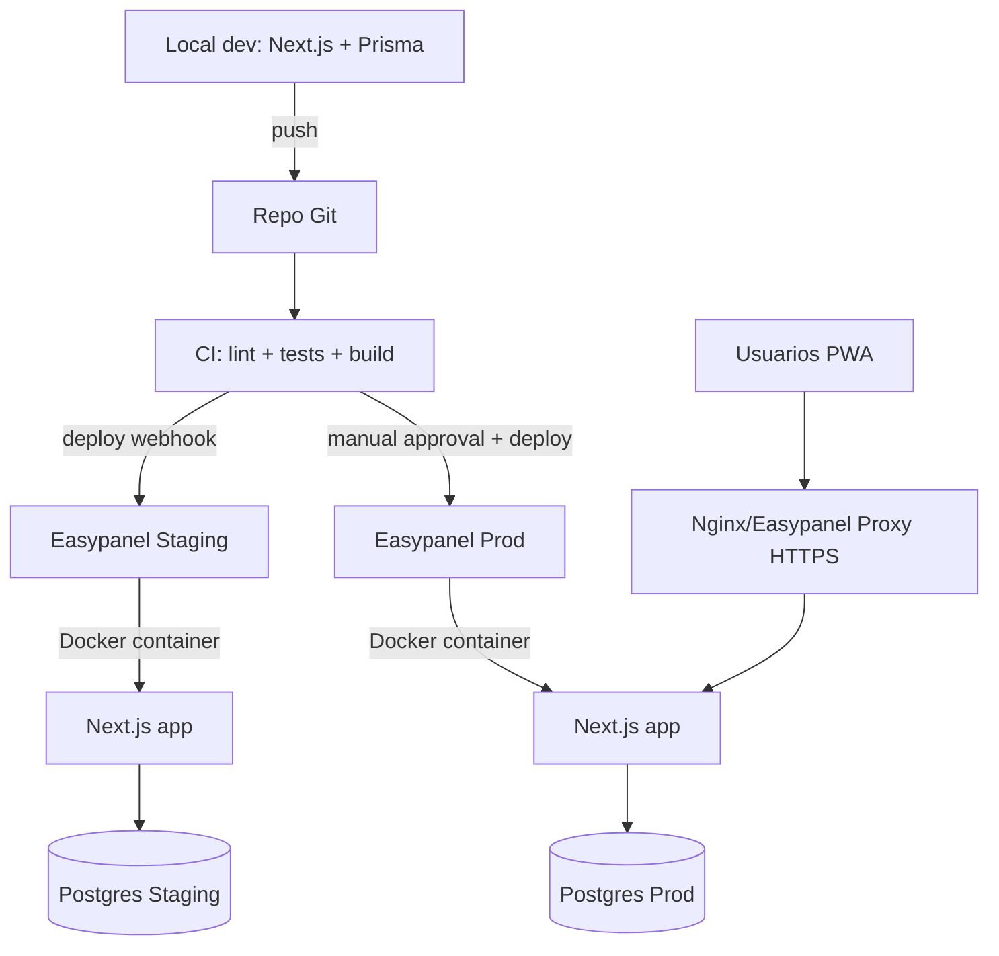
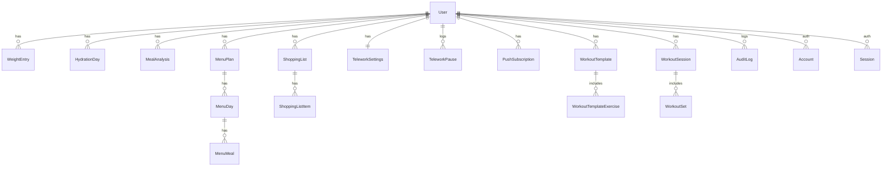

# PRD técnico ejecutable para SapoFit v2.0 con agentes automatizados

## Resumen ejecutivo

SapoFit v2.0 debe pasar de un prototipo tipo v0, centrado en UI y estado en memoria, a un producto con persistencia real, autenticación sólida, control de costes de IA, PWA instalable con offline y Web Push, y operación segura en VPS con contenedores. El repositorio actual (SapoDietApp) está pensado para mantenerse sincronizado automáticamente con v0.app y desplegar en Vercel, lo que condiciona el flujo de trabajo y no encaja con un delivery controlado por CI/CD y entornos staging/prod.citeturn41view0

La base técnica propuesta sigue siendo viable: Next.js App Router y Server Actions para el “backend for frontend”, PostgreSQL con Prisma, RBAC (ADMIN/USER), y fotos efímeras para IA. El salto a “ejecutable por agentes” requiere convertir ese documento maestro en artefactos verificables: esquema Prisma completo, contrato de API, servicios internos con responsabilidades claras, pipeline CI/CD con gates, y un runbook de operación para agentes sin acceso root. El cambio más importante del plan original es este: dejar de desarrollar y desplegar “a dedo” en el VPS y mover el control a Git + CI/CD + Easypanel, de forma que el VPS ejecute contenedores y el repositorio sea la fuente de verdad. Easypanel soporta despliegues desde repositorio y auto deploy vía webhook, así que puedes integrarlo con Actions para que solo despliegue si los checks pasan.citeturn29view0

En cumplimiento de GDPR, SapoFit trata datos de salud (peso, IMC, hábitos), que caen en categorías especiales: el RGPD prohíbe por defecto el tratamiento de datos relativos a la salud salvo que se cumplan bases legales y garantías; y el usuario tiene derecho de supresión sin dilación indebida bajo condiciones.citeturn36view0turn36view1turn37view0 Esto obliga a un diseño de minimización, cifrado en tránsito, controles de acceso, y hard delete real (con cascadas) para el botón “Eliminar mi cuenta y mis datos”.

## Alcance y objetivos

El punto de partida real es el repositorio existente: hoy concentra la lógica de “configuración inicial”, generación de plan nutricional, lista de compra, y seguimiento de comidas/ejercicios en estado local, incluyendo un análisis de foto simulado.citeturn14view1turn17view2turn19view1turn11view0 El PRD v2.0 debe convertir eso en módulos productivos con datos persistidos y límites de uso.

### Objetivos medibles

El sistema se considera listo para producción cuando:

- Un usuario puede autenticarse con magic link (y opcionalmente contraseña), tener sesión persistente y navegar por `/dashboard`, `/history`, `/settings`.citeturn38view1  
- Los pesos diarios se guardan en PostgreSQL y se grafican; el IMC se calcula con la altura del perfil.
- La ingesta de agua diaria se registra por día y se refleja en KPIs.
- La IA de foto de comida consume cuota diaria por usuario y el servidor no persiste la imagen (solo guarda resultados).  
- Web Push funciona para recordatorios (telework) en navegadores soportados; la suscripción se guarda por usuario y el envío se ejecuta desde un “worker”/cron.citeturn25view0turn39search2turn39search3  
- “Eliminar mi cuenta” ejecuta hard delete de todas las tablas del usuario (incluida la suscripción push), y deja trazabilidad mínima en audit logs sin datos sensibles.

### Alcance por módulos

**Core (MVP v2.0)**  
Autenticación + RBAC, Dashboard (peso, meta, agua, resumen calórico simple), Historial + IMC, Ajustes/Perfil, Admin básico (usuarios, invitaciones, cuotas IA), IA de análisis de foto (efímero) con cuota diaria, Telework con Web Push.

**Opcionales (post-MVP)**  
Generador de menú semanal IA + lista de compra por pasillos + multiplicador familiar, entrenamiento completo con modo offline y sincronización robusta, métricas avanzadas por usuario, y recomendaciones personalizadas.

### Observaciones sobre el repositorio actual

El repo actual está pensado para “sync automático con v0.app” y “deploy en Vercel”, con metadatos de v0 en layout y Analytics de Vercel.citeturn41view0turn13view0 Además, incluye configuración de build que ignora errores de TypeScript y ESLint, lo que no es aceptable para producción (debe eliminarse y forzar quality gates).citeturn6view0

## Arquitectura e infraestructura

### Arquitectura objetivo

- **Frontend + BFF**: Next.js App Router (Server Components) + Server Actions para formularios y mutaciones del core.citeturn39search0  
- **APIs “de peso”**: Route Handlers (`app/api/.../route.ts`) para endpoints que necesiten control fino (subida de imagen, sync offline, webhooks).  
- **Persistencia**: PostgreSQL + Prisma.  
- **Infra**: VPS con contenedores en Easypanel, 2 entornos (staging y prod) con dominios separados o subdominios. Easypanel construye imagen desde repo si existe Dockerfile y puede auto desplegar con webhooks.citeturn29view0  
- **Proxy**: Nginx o proxy gestionado por Easypanel delante de Next.js. Next recomienda reverse proxy para self-hosting por razones de seguridad y control (rate limiting, límites de payload, etc.).citeturn32view0

### Redes, seguridad de despliegue y Server Actions

Para Server Actions, hay dos puntos críticos:

- **CSRF por origen**: Next.js compara `Origin` y `Host` y permite configurar `allowedOrigins` si hay proxy o dominios adicionales.citeturn40view0  
- **Tamaño de cuerpo**: el tamaño máximo por defecto para requests a Server Actions es 1MB; se puede subir con `bodySizeLimit`, pero para fotos es mejor usar Route Handlers y comprimir en cliente.citeturn40view0

### Contenedores Docker

Para producción, usa una imagen con build multi-stage y ejecución como usuario no root. El ejemplo oficial de Next en Docker (multi-stage, `USER node`, `output: standalone`) es una base directa para tu Dockerfile.citeturn33view0 El patrón multi-stage está recomendado para reducir tamaño y superficie de ataque.citeturn21search12

### Backups y recuperación

- **Backups DB**: `pg_dump` diario con retención (7-30 días) y cifrado. La herramienta oficial `pg_dump` es el baseline para backups lógicos de PostgreSQL.citeturn3search3  
- **Restore**: `pg_restore` en una base nueva de staging para probar recuperación semanalmente (ensayo de desastre).  
- **Artefactos**: versiones de imagen Docker etiquetadas por commit SHA y tag de release.

### Logs, auditoría y rotación

- **Logs de app**: logs estructurados JSON a stdout y, opcionalmente, ficheros rotados en un volumen (solo si lo necesitas para auditoría local). `winston-daily-rotate-file` soporta rotación por día/hora/tamaño.citeturn23search2  
- **Buenas prácticas**: evitar loguear datos sensibles (tokens, emails en claro, payloads de IA). OWASP recomienda diseñar logging con foco en seguridad.citeturn22search1

### Gestión de secretos

Dos niveles:

- **En CI/CD y repositorio**: secrets en GitHub Actions (repo secrets y environment secrets).citeturn20search5turn20search12  
- **En runtime**: variables en Easypanel (disponibles build-time y run-time).citeturn29view0  
Si usas docker-compose local, para secretos reales (passwords, claves) considera “secrets” como ficheros montados, porque las env vars se filtran con facilidad a logs y procesos.citeturn30view0

### Alternativas técnicas

A continuación tienes 3 opciones por dimensión, para que puedas decidir si mantienes el monolito Next o separas.

**Backend**
- Opción A: Next.js (Server Actions + Route Handlers) como monolito BFF.
- Opción B: Backend separado (API HTTP) y Next como frontend puro.
- Opción C: “Backend gestionado” (BaaS) y Next como cliente.

**Persistencia**
- Opción A: PostgreSQL + Prisma (recomendado: migraciones y tipado end-to-end).
- Opción B: PostgreSQL + query builder (menos ORM, más SQL).
- Opción C: PostgreSQL + capa GraphQL gestionada.

**Auth**
- Opción A: Auth.js (Email magic link) + Prisma adapter.citeturn38view1turn28view0  
- Opción B: Email magic link con implementación propia (tokens firmados y DB).
- Opción C: Proveedor externo de identidad.

**Push**
- Opción A: Web Push nativo + VAPID + `web-push` (alineado con guía oficial PWA de Next).citeturn25view0  
- Opción B: Servicio gestionado de push (menos infra, más dependencia).
- Opción C: Push “solo in-app” (sin notificación del sistema) para reducir complejidad.

### Diagramas de despliegue y CI/CD



citeturn29view0turn32view0turn20search2turn20search19

```mermaid
gantt
  title CI/CD (visión temporal de un push a producción)
  dateFormat  HH:mm
  axisFormat  %H:%M
  section Pull Request
  lint + typecheck         :a1, 00:00, 00:05
  unit tests (Vitest)      :a2, after a1, 00:08
  e2e smoke (Playwright)   :a3, after a2, 00:12
  section Merge a develop
  deploy staging (Easypanel) :b1, after a3, 00:04
  smoke staging               :b2, after b1, 00:06
  section Release
  approval prod             :c1, after b2, 00:30
  deploy prod (Easypanel)   :c2, after c1, 00:04
  post-deploy checks        :c3, after c2, 00:06
```



citeturn20search2turn20search19turn29view0turn20search9

## Modelo de datos y Prisma

### Principios del modelo

- Un usuario (Auth.js) es la raíz de todos los datos: pesos, hidratación, telework, suscripciones push, planes de comida, sesiones de entrenamiento, auditoría.
- Hard delete: todo debe borrar en cascada al eliminar cuenta.
- Fotos de comidas: no se guardan; solo se guarda el resultado estructurado (macros/ingredientes) y metadatos mínimos (fecha, tipo de comida, fuente).

El esquema de Auth.js con PostgreSQL y Prisma está documentado y sirve como base, incluyendo `User`, `Account`, `Session`, y `VerificationToken`.citeturn28view0turn38view1

### Esquema Prisma completo propuesto

```prisma
// prisma/schema.prisma

generator client {
  provider = "prisma-client-js"
}

datasource db {
  provider = "postgresql"
  url      = env("DATABASE_URL")
}

enum Role {
  ADMIN
  USER
}

enum WeightUnit {
  KG
  LB
}

enum MealType {
  DESAYUNO
  MEDIA_MANANA
  ALMUERZO
  MERIENDA
  CENA
}

model User {
  // Auth.js core
  id            String    @id @default(cuid())
  name          String?
  email         String?   @unique
  emailVerified DateTime? @map("email_verified")
  image         String?

  accounts Account[]
  sessions Session[]

  // App extensions
  role               Role       @default(USER)
  heightCm           Int?
  weightUnit         WeightUnit @default(KG)
  goalWeightKg       Decimal?   @db.Decimal(6, 2)
  familySize         Int        @default(1)

  // IA quota control
  aiDailyLimit       Int        @default(10)
  aiRequestsCount    Int        @default(0)
  aiRequestsDate     DateTime?  // truncado a día (normalizado en app)

  // Preferences
  pushEnabled        Boolean    @default(false)
  theme              String?    // "light" | "dark" | "system"

  createdAt DateTime @default(now())
  updatedAt DateTime @updatedAt

  // Relations
  weightEntries          WeightEntry[]
  hydrationDays          HydrationDay[]
  mealAnalyses           MealAnalysis[]
  menuPlans              MenuPlan[]
  shoppingLists          ShoppingList[]
  teleworkSettings       TeleworkSettings?
  teleworkPauses         TeleworkPause[]
  pushSubscriptions      PushSubscription[]
  workoutTemplates       WorkoutTemplate[]
  workoutSessions        WorkoutSession[]
  auditLogs              AuditLog[]
  invitationsCreated     Invitation[] @relation("InvitationCreatedBy")

  @@map("users")
}

model Account {
  id                String  @id @default(cuid())
  userId            String  @map("user_id")
  type              String
  provider          String
  providerAccountId String  @map("provider_account_id")
  refresh_token     String? @db.Text
  access_token      String? @db.Text
  expires_at        Int?
  token_type        String?
  scope             String?
  id_token          String? @db.Text
  session_state     String?

  user User @relation(fields: [userId], references: [id], onDelete: Cascade)

  @@unique([provider, providerAccountId])
  @@map("accounts")
}

model Session {
  id           String   @id @default(cuid())
  sessionToken String   @unique @map("session_token")
  userId       String   @map("user_id")
  expires      DateTime

  user User @relation(fields: [userId], references: [id], onDelete: Cascade)

  @@map("sessions")
}

model VerificationToken {
  identifier String
  token      String   @unique
  expires    DateTime

  @@unique([identifier, token])
  @@map("verification_tokens")
}

model Invitation {
  id            String   @id @default(cuid())
  email         String
  tokenHash     String   @unique
  role          Role     @default(USER)
  expiresAt     DateTime
  usedAt        DateTime?
  createdAt     DateTime @default(now())

  createdById   String?
  createdBy     User? @relation("InvitationCreatedBy", fields: [createdById], references: [id], onDelete: SetNull)

  @@index([email])
  @@map("invitations")
}

model WeightEntry {
  id        String   @id @default(cuid())
  userId    String
  date      DateTime // normalizado a día
  weightKg  Decimal  @db.Decimal(6, 2)
  note      String?  @db.Text
  bmi       Decimal? @db.Decimal(5, 2)

  createdAt DateTime @default(now())

  user User @relation(fields: [userId], references: [id], onDelete: Cascade)

  @@unique([userId, date])
  @@index([userId, date])
  @@map("weight_entries")
}

model HydrationDay {
  id          String   @id @default(cuid())
  userId      String
  date        DateTime // normalizado a día
  liters      Decimal  @db.Decimal(4, 2) @default(0)
  goalLiters  Decimal  @db.Decimal(4, 2) @default(2.5)

  createdAt DateTime @default(now())
  updatedAt DateTime @updatedAt

  user User @relation(fields: [userId], references: [id], onDelete: Cascade)

  @@unique([userId, date])
  @@index([userId, date])
  @@map("hydration_days")
}

model MealAnalysis {
  id          String   @id @default(cuid())
  userId      String
  mealType    MealType
  eatenAt     DateTime @default(now())

  calories    Int?
  proteinG    Decimal? @db.Decimal(6, 2)
  carbsG      Decimal? @db.Decimal(6, 2)
  fatG        Decimal? @db.Decimal(6, 2)

  ingredients String[] // Postgres array
  summary     String?  @db.Text

  // IA metering
  aiModel     String?
  aiLatencyMs Int?
  aiSuccess   Boolean  @default(true)

  createdAt DateTime @default(now())

  user User @relation(fields: [userId], references: [id], onDelete: Cascade)

  @@index([userId, eatenAt])
  @@map("meal_analyses")
}

model MenuPlan {
  id          String   @id @default(cuid())
  userId      String
  startDate   DateTime
  endDate     DateTime
  targetKcal  Int?
  targetP     Decimal? @db.Decimal(6, 2)
  targetC     Decimal? @db.Decimal(6, 2)
  targetF     Decimal? @db.Decimal(6, 2)
  aiModel     String?
  createdAt   DateTime @default(now())

  days MenuDay[]
  user User @relation(fields: [userId], references: [id], onDelete: Cascade)

  @@index([userId, startDate])
  @@map("menu_plans")
}

model MenuDay {
  id        String   @id @default(cuid())
  menuPlanId String
  date      DateTime

  meals MenuMeal[]

  menuPlan MenuPlan @relation(fields: [menuPlanId], references: [id], onDelete: Cascade)

  @@unique([menuPlanId, date])
  @@map("menu_days")
}

model MenuMeal {
  id        String   @id @default(cuid())
  menuDayId String
  mealType  MealType
  name      String
  calories  Int?
  proteinG  Decimal? @db.Decimal(6, 2)
  carbsG    Decimal? @db.Decimal(6, 2)
  fatG      Decimal? @db.Decimal(6, 2)
  ingredients String[] // lista de ingredientes "human-readable"

  menuDay MenuDay @relation(fields: [menuDayId], references: [id], onDelete: Cascade)

  @@unique([menuDayId, mealType])
  @@map("menu_meals")
}

model ShoppingList {
  id        String   @id @default(cuid())
  userId    String
  menuPlanId String?
  title     String
  familySize Int @default(1)
  createdAt DateTime @default(now())

  items ShoppingListItem[]

  user User @relation(fields: [userId], references: [id], onDelete: Cascade)
  menuPlan MenuPlan? @relation(fields: [menuPlanId], references: [id], onDelete: SetNull)

  @@index([userId, createdAt])
  @@map("shopping_lists")
}

model ShoppingListItem {
  id            String   @id @default(cuid())
  shoppingListId String
  aisle         String   // "Frutería", "Carnicería", etc.
  name          String
  quantity      String?  // "2 kg", "3 uds", etc.
  checked       Boolean  @default(false)

  shoppingList ShoppingList @relation(fields: [shoppingListId], references: [id], onDelete: Cascade)

  @@index([shoppingListId, aisle])
  @@map("shopping_list_items")
}

model TeleworkSettings {
  id            String   @id @default(cuid())
  userId        String   @unique
  workStart     String   // "09:00"
  workEnd       String   // "18:00"
  frequencyMin  Int      @default(60)
  enabled       Boolean  @default(false)
  updatedAt     DateTime @updatedAt

  user User @relation(fields: [userId], references: [id], onDelete: Cascade)

  @@map("telework_settings")
}

model TeleworkPause {
  id        String   @id @default(cuid())
  userId    String
  at        DateTime @default(now())
  source    String?  // "push", "manual"
  user User @relation(fields: [userId], references: [id], onDelete: Cascade)

  @@index([userId, at])
  @@map("telework_pauses")
}

model PushSubscription {
  id          String   @id @default(cuid())
  userId      String
  endpoint    String   @unique
  p256dh      String
  auth        String
  userAgent   String?
  createdAt   DateTime @default(now())
  revokedAt   DateTime?

  user User @relation(fields: [userId], references: [id], onDelete: Cascade)

  @@index([userId])
  @@map("push_subscriptions")
}

model WorkoutTemplate {
  id        String   @id @default(cuid())
  userId    String
  name      String
  createdAt DateTime @default(now())
  exercises WorkoutTemplateExercise[]
  user User @relation(fields: [userId], references: [id], onDelete: Cascade)

  @@index([userId, createdAt])
  @@map("workout_templates")
}

model WorkoutTemplateExercise {
  id               String @id @default(cuid())
  workoutTemplateId String
  name             String
  order            Int
  defaultSets      Int? // opcional

  workoutTemplate WorkoutTemplate @relation(fields: [workoutTemplateId], references: [id], onDelete: Cascade)

  @@unique([workoutTemplateId, order])
  @@map("workout_template_exercises")
}

model WorkoutSession {
  id        String   @id @default(cuid())
  userId    String
  templateId String?
  startedAt DateTime @default(now())
  endedAt   DateTime?

  sets WorkoutSet[]

  user User @relation(fields: [userId], references: [id], onDelete: Cascade)
  template WorkoutTemplate? @relation(fields: [templateId], references: [id], onDelete: SetNull)

  @@index([userId, startedAt])
  @@map("workout_sessions")
}

model WorkoutSet {
  id             String   @id @default(cuid())
  workoutSessionId String
  exerciseName   String
  setNumber      Int
  reps           Int?
  weightKg       Decimal? @db.Decimal(6, 2)
  createdAt      DateTime @default(now())

  workoutSession WorkoutSession @relation(fields: [workoutSessionId], references: [id], onDelete: Cascade)

  @@index([workoutSessionId, exerciseName])
  @@map("workout_sets")
}

model AuditLog {
  id          String   @id @default(cuid())
  userId      String?
  actorRole   Role?
  action      String
  entity      String?
  entityId    String?
  ip          String?
  userAgent   String?
  createdAt   DateTime @default(now())

  // No payload sensible aquí. Si hace falta, guarda hashes.
  user User? @relation(fields: [userId], references: [id], onDelete: SetNull)

  @@index([createdAt])
  @@index([userId, createdAt])
  @@map("audit_logs")
}
```

citeturn28view0turn38view1

### Migraciones iniciales

Regla operativa:

- Desarrollo: `prisma migrate dev`.citeturn26search3  
- Producción: `prisma migrate deploy` dentro de CI/CD (no local).citeturn26search6

Comandos base:

```bash
# instalar deps
pnpm add @prisma/client
pnpm add -D prisma tsx @types/pg

# init prisma
npx prisma init

# crear migración inicial
npx prisma migrate dev --name init

# seed
npx prisma db seed

# producción
npx prisma migrate deploy
```

citeturn26search3turn26search6

### ERD en Mermaid



citeturn28view0

## API contract y servicios internos

### Estándar de errores

Formato único:

```json
{
  "error": {
    "code": "AI_QUOTA_EXCEEDED",
    "message": "Límite diario de IA alcanzado",
    "requestId": "req_01H..."
  }
}
```

Códigos `code` comunes: `UNAUTHORIZED`, `FORBIDDEN`, `VALIDATION_ERROR`, `NOT_FOUND`, `CONFLICT`, `RATE_LIMITED`, `AI_PROVIDER_ERROR`, `AI_QUOTA_EXCEEDED`.

### Tabla de endpoints

| Área | Endpoint | Método | Auth | Request (JSON) | Response (JSON) |
|---|---|---:|---|---|---|
| Usuario | `/api/me` | GET | USER | - | `{ user, settings }` |
| Perfil | `/api/profile` | PATCH | USER | `{ name?, heightCm?, weightUnit?, goalWeightKg?, familySize? }` | `{ ok: true }` |
| Weight | `/api/weights` | GET | USER | `?from=YYYY-MM-DD&to=YYYY-MM-DD` | `{ items: WeightEntry[] }` |
| Weight | `/api/weights` | POST | USER | `{ date, weightKg, note? }` | `{ item }` |
| Weight | `/api/weights/{id}` | DELETE | USER | - | `{ ok: true }` |
| Hidratación | `/api/hydration` | GET | USER | `?date=YYYY-MM-DD` | `{ day }` |
| Hidratación | `/api/hydration` | PATCH | USER | `{ date, liters, goalLiters? }` | `{ day }` |
| IA foto | `/api/ai/meal-photo` | POST | USER | `multipart/form-data: file, mealType` | `{ analysis }` |
| IA menú | `/api/ai/menu-plan` | POST | USER | `{ startDate, days }` | `{ menuPlanId }` |
| Compra | `/api/shopping-list` | POST | USER | `{ menuPlanId?, familySize }` | `{ shoppingListId }` |
| Push | `/api/push/subscribe` | POST | USER | `{ endpoint, keys: { p256dh, auth }, userAgent? }` | `{ ok: true }` |
| Push | `/api/push/unsubscribe` | POST | USER | `{ endpoint }` | `{ ok: true }` |
| Telework | `/api/telework/settings` | PUT | USER | `{ enabled, workStart, workEnd, frequencyMin }` | `{ ok: true }` |
| Telework | `/api/telework/pause` | POST | USER | `{ source? }` | `{ ok: true }` |
| Offline sync | `/api/sync` | POST | USER | `{ clientId, ops: [{ opId, type, payload, ts }] }` | `{ applied: string[], rejected: [...] }` |
| Admin users | `/api/admin/users` | GET | ADMIN | - | `{ users: [...] }` |
| Admin invites | `/api/admin/invitations` | POST | ADMIN | `{ email, role, expiresInHours }` | `{ inviteLink }` |
| Admin IA limits | `/api/admin/users/{id}/ai-limit` | PATCH | ADMIN | `{ aiDailyLimit }` | `{ ok: true }` |
| GDPR delete | `/api/gdpr/delete-account` | POST | USER | `{ confirm: true }` | `{ ok: true }` |

Notas clave de referencia:
- Web Push: el flujo de suscripción usa `PushManager.subscribe()` y devuelve `PushSubscription`.citeturn39search2turn25view0  
- Notificaciones desde service worker: `ServiceWorkerRegistration.showNotification()`.citeturn39search3turn39search11  
- Magic links: el email provider envía un verification token (expira y requiere base de datos).citeturn38view1

### Servicios internos y responsabilidades

Estructura propuesta:

- `src/server/services/weight.service.ts`
- `src/server/services/ai.service.ts`
- `src/server/services/reminder.service.ts`
- `src/server/services/admin.service.ts`

#### Weight service

Responsabilidad: CRUD de pesos, cálculo de IMC por entrada, tendencia.

Pseudocódigo:

```ts
// weight.service.ts (pseudocódigo)
function normalizeDay(dateISO: string): Date { /* trunc a 00:00 local or UTC */ }

async function upsertWeight(userId, { dateISO, weightKg, note }) {
  const date = normalizeDay(dateISO)
  const user = await prisma.user.findUnique({ where: { id: userId } })
  const bmi = user.heightCm
    ? round2(weightKg / Math.pow(user.heightCm / 100, 2))
    : null

  return prisma.weightEntry.upsert({
    where: { userId_date: { userId, date } },
    create: { userId, date, weightKg, note, bmi },
    update: { weightKg, note, bmi }
  })
}

async function listWeights(userId, fromISO, toISO) { /* range query */ }
```

#### AI service

Responsabilidad: validar cuota, preparar prompt, enviar imagen a Gemini, validar JSON de respuesta, persistir solo resultados.

Gemini admite paso de imágenes inline (base64/bytes) y recomienda File API para ficheros grandes; el límite de request total para inline se documenta en 20MB.citeturn38view0turn38view2

Pseudocódigo:

```ts
// ai.service.ts (pseudocódigo)
async function assertAndConsumeAiQuota(user) {
  const today = normalizeDay(nowISO())
  if (!user.aiRequestsDate || normalizeDay(user.aiRequestsDate.toISOString()) !== today) {
    user = await prisma.user.update({
      where: { id: user.id },
      data: { aiRequestsCount: 0, aiRequestsDate: today }
    })
  }
  if (user.aiRequestsCount >= user.aiDailyLimit) throw AI_QUOTA_EXCEEDED
  await prisma.user.update({ where: { id: user.id }, data: { aiRequestsCount: { increment: 1 } } })
}

async function analyzeMealPhoto(userId, fileBytes, mealType) {
  const user = await prisma.user.findUnique({ where: { id: userId } })
  await assertAndConsumeAiQuota(user)

  // Prompt: pedir JSON estricto
  const prompt = buildPromptForMeal(mealType)

  const resp = await gemini.generateContent({
    imageBytes: fileBytes,
    mimeType: "image/jpeg",
    prompt
  })

  const parsed = zodMealAnalysis.parse(resp.json)
  await prisma.mealAnalysis.create({
    data: {
      userId,
      mealType,
      calories: parsed.kcal,
      proteinG: parsed.p,
      carbsG: parsed.c,
      fatG: parsed.f,
      ingredients: parsed.ingredients,
      summary: parsed.summary,
      aiModel: resp.model,
      aiSuccess: true
    }
  })
  return parsed
}
```

#### Reminder service

Responsabilidad: almacenar suscripciones push, programar y enviar notificaciones según telework settings.

Puntos técnicos:
- La guía PWA de Next describe `web-push`, generación de VAPID y service worker con listener de `push`.citeturn25view0  
- En cliente, `PushManager.subscribe()` requiere `userVisibleOnly: true` y `applicationServerKey`.citeturn25view0turn39search6turn39search10  

Pseudocódigo:

```ts
// reminder.service.ts (pseudocódigo)
async function registerSubscription(userId, sub) {
  return prisma.pushSubscription.upsert({
    where: { endpoint: sub.endpoint },
    create: { userId, endpoint: sub.endpoint, p256dh: sub.keys.p256dh, auth: sub.keys.auth, userAgent: sub.userAgent },
    update: { revokedAt: null, userId }
  })
}

async function tickReminders(now) {
  const users = await prisma.teleworkSettings.findMany({ where: { enabled: true } })
  for (const s of users) {
    if (!withinWorkHours(s, now)) continue
    if (!isReminderDue(s, now)) continue

    const subs = await prisma.pushSubscription.findMany({ where: { userId: s.userId, revokedAt: null } })
    await sendPushToAll(subs, { title: "Pausa activa", body: "Es hora de moverse" })
  }
}
```

#### Admin service

Responsabilidad: invitaciones, límites IA, métricas agregadas, auditoría.

Pseudocódigo:

```ts
// admin.service.ts (pseudocódigo)
async function createInvitation(adminId, email, role, expiresInHours) {
  const token = randomToken()
  const tokenHash = sha256(token)
  await prisma.invitation.create({
    data: { email, role, tokenHash, expiresAt: nowPlusHours(expiresInHours), createdById: adminId }
  })
  return buildInviteLink(token) // token solo en URL, nunca se guarda en claro
}
```

### Flujos de datos en Mermaid

#### Flowchart: análisis de foto IA (efímero)

```mermaid
flowchart TD
  A[PWA: usuario toma foto] --> B[Cliente comprime imagen]
  B --> C[POST /api/ai/meal-photo multipart]
  C --> D{Auth session válida?}
  D -->|no| E[401]
  D -->|sí| F{Quota diaria disponible?}
  F -->|no| G[429 AI_QUOTA_EXCEEDED]
  F -->|sí| H[Enviar bytes a Gemini]
  H --> I[Validar JSON con Zod]
  I --> J[Guardar resultado (sin foto)]
  J --> K[Responder analysis]
  H --> L[Error provider]
  L --> M[Guardar log mínimo + devolver 502]
```

citeturn38view0turn40view0turn25view0

#### Flowchart: sync offline entrenamiento

```mermaid
flowchart TD
  A[Usuario en gym sin red] --> B[Guardar ops en IndexedDB]
  B --> C[UI local actualiza progreso]
  C --> D{Vuelve conexión?}
  D -->|no| B
  D -->|sí| E[POST /api/sync ops[]]
  E --> F[Verificar sesión + validar ops]
  F --> G[Aplicar ops idempotentes]
  G --> H[Responder applied[]]
  H --> I[Cliente marca ops como sincronizadas]
```

citeturn3search1turn3search2

## Entrega automatizada, QA, seguridad y operación de agentes

### Política Git y ramas

Modelo simple y ejecutable:

- `main`: producción.
- `develop`: staging.
- `feature/*`: trabajo de agentes.
- `hotfix/*`: correcciones urgentes desde `main`.

Políticas:

- PR obligatorio hacia `develop` (y de `develop` a `main`).
- Checks obligatorios: lint, typecheck, unit tests, e2e smoke.
- Environments en CI con protección para producción (approval manual).citeturn20search8turn20search19

### Pipeline CI/CD

#### Workflow mínimo (GitHub Actions)

Referencia de sintaxis y secretos: workflows se definen en YAML y los secretos se gestionan a nivel repo/environments.citeturn20search2turn20search5turn20search12

```yaml
# .github/workflows/ci.yml
name: ci

on:
  pull_request:
  push:
    branches: [develop, main]

jobs:
  test:
    runs-on: ubuntu-latest
    steps:
      - uses: actions/checkout@v4
      - uses: pnpm/action-setup@v4
        with:
          version: 9
      - uses: actions/setup-node@v4
        with:
          node-version: 20
          cache: "pnpm"
      - run: pnpm install --frozen-lockfile
      - run: pnpm lint
      - run: pnpm test
      - run: pnpm test:e2e -- --reporter=line
        env:
          # si necesitas base URL local para e2e
          NEXTAUTH_URL: http://localhost:3000

  deploy_staging:
    if: github.ref == 'refs/heads/develop' && github.event_name == 'push'
    needs: [test]
    runs-on: ubuntu-latest
    environment: staging
    steps:
      - name: Trigger Easypanel deploy
        run: |
          curl -X POST "$EASYPANEL_STAGING_WEBHOOK"
        env:
          EASYPANEL_STAGING_WEBHOOK: ${{ secrets.EASYPANEL_STAGING_WEBHOOK }}

  deploy_prod:
    if: github.ref == 'refs/heads/main' && github.event_name == 'push'
    needs: [test]
    runs-on: ubuntu-latest
    environment: production
    steps:
      - name: Trigger Easypanel deploy
        run: |
          curl -X POST "$EASYPANEL_PROD_WEBHOOK"
        env:
          EASYPANEL_PROD_WEBHOOK: ${{ secrets.EASYPANEL_PROD_WEBHOOK }}
```

citeturn29view0turn20search2turn20search5turn20search19

Rollback operativo (que sí funciona siempre):
- Revert del commit en `main` y nuevo deploy.
- O redeploy del tag anterior (si mantienes tags e imágenes por SHA en Easypanel).

### Plan de pruebas

**Unit (Vitest)**: Next recomienda Vitest para unit testing y documenta setup.citeturn20search20turn20search1  
**E2E (Playwright)**: guía específica para Next y documentación oficial.citeturn20search9turn20search6turn20search3

Casos mínimos:

- Auth: login por email (staging), sesión y logout.citeturn38view1  
- IA: deducción de cuota y bloqueo al exceder límite.
- Offline sync: simular pérdida de red, registrar sets y sincronizar.
- Admin: solo ADMIN entra a `/admin` (middleware + RBAC).

### Checklist de aceptación por módulo

**Auth + RBAC**
- USER no accede a `/admin`.
- ADMIN ve lista de usuarios y crea invitaciones válidas.

**Dashboard**
- Peso actual y objetivo visibles.
- Hidratación incrementa/decrementa y persiste por día.

**Historial + IMC**
- Crear peso diario (único por día).
- Graficar rango y mostrar IMC calculado cuando haya altura.

**IA Dieta**
- Subir foto, recibir macros, guardar solo resultado.
- Límite diario aplica por usuario.

**Telework Push**
- Suscripción se guarda y se puede revocar.
- Worker envía notificación en horario configurado.

**GDPR Delete**
- Hard delete elimina registros relacionados.
- Se registra auditoría sin contenido sensible.

### Checklist de seguridad y GDPR

Base normativa:
- Categorías especiales (salud): tratamiento prohibido salvo condiciones, exige garantías.citeturn36view0turn37view0  
- Derecho de supresión: “sin dilación indebida” bajo condiciones.citeturn36view1  

Controles mínimos:
- HTTPS obligatorio (PWA instalable lo requiere).citeturn25view0  
- Cookies de sesión con `HttpOnly`, `Secure`, `SameSite=Lax|Strict` (según flujo).
- CSRF: usar protección nativa de Auth.js en rutas de auth; para APIs propias, validar `Origin` y exigir sesión. Auth.js documenta CSRF y el endpoint `/api/auth/csrf` en NextAuth.citeturn22search10turn22search4  
- Passwords (si habilitas credenciales): hashing fuerte (Argon2id o bcrypt con coste adecuado).citeturn22search0  
- Logging: redacción de PII y secretos.citeturn22search1  
- Minimización: no almacenar fotos de comidas; solo resultados.
- Retención: define política (por ejemplo, borrar audit logs técnicos a 30-90 días si no son necesarios).
- Export: opcional, pero si lo implementas, debe ser por usuario y autenticado.

### Operación para agentes IA

Punto crítico: agentes no deben desarrollar como root en el VPS. El VPS tiene que ser “runtime”, no “IDE”.

Propuesta operativa:

- Agentes trabajan en ramas `feature/*` y abren PR a `develop`.
- CI ejecuta gates.
- Deploy se hace por webhook a Easypanel o por pipeline aprobado.

Credenciales y rotación:

- Para despliegues o pulls desde servidor, usa deploy keys read-only donde aplique. La API de deploy keys soporta `read_only`; y las claves con write tienen poder equivalente a un colaborador con admin, así que deben evitarse para runtime.citeturn31view0  
- Secrets en Actions con rotación programada (mensual o trimestral).citeturn20search5turn20search12

Auditoría:

- Cada acción de admin y cada uso de IA crea `AuditLog` (sin payload sensible).
- Guarda `requestId` correlacionable con logs.

### Sprint backlog y estimaciones

#### Sprint backlog (6 sprints)

| Sprint | Prioridad | Entregables |
|---|---:|---|
| Sprint A | P0 | Repo nuevo o refactor base, Dockerfile, Easypanel staging, PostgreSQL, Prisma init |
| Sprint B | P0 | Auth.js email magic link + Prisma adapter, middleware RBAC, `/dashboard` mínimo |
| Sprint C | P0 | Pesos + Historial + IMC + hidratación persistente |
| Sprint D | P0 | IA foto (efímera) + cuota diaria + admin límites |
| Sprint E | P1 | Web Push + Telework settings + worker/cron |
| Sprint F | P1 | Offline sync entrenamiento + e2e completo + hard delete GDPR |

Referencias de soporte técnico: PWA y Web Push en Next, incluyendo VAPID y service worker.citeturn25view0

#### Estimaciones (h/h)

Estimación para 1 dev o 1 agente “en serie”, sin paralelizar:

| Épica | Horas (rango) | Notas |
|---|---:|---|
| Bootstrap + Docker + Easypanel | 10-16 | Incluye staging y variables |
| Prisma schema + migraciones + seed | 10-14 | Incluye cascadas y constraints |
| Auth.js + RBAC + Admin base | 14-22 | Incluye invitaciones seguras |
| Dashboard + History + Settings | 18-28 | UI + server actions + charts |
| IA foto + cuota + logs | 12-20 | Incluye Zod y manejo de errores |
| Web Push + worker + telework | 16-26 | Suscripción, envío, scheduler |
| Offline sync + idempotencia | 18-30 | IndexedDB + endpoint batch |
| Tests (Vitest + Playwright) | 16-24 | Smoke + flujos críticos |
| Seguridad + GDPR hard delete | 10-16 | Auditoría mínima + borrado |

Guías de testing: Next con Playwright y Vitest.citeturn20search9turn20search20

### Comandos y scripts listos para copiar y publicar en Git

#### Crear en local y publicar repositorio

```bash
# 1) crear proyecto
pnpm dlx create-next-app@latest sapofit \
  --typescript --tailwind --eslint --app --src-dir=false --import-alias "@/*"

cd sapofit

# 2) instalar dependencias base
pnpm add zod
pnpm add @prisma/client
pnpm add -D prisma tsx @types/pg vitest @playwright/test

# 3) init prisma
npx prisma init

# 4) git
git init
git add .
git commit -m "chore: bootstrap sapofit v2"
git branch -M main
git remote add origin git@github.com:OWNER/REPO.git
git push -u origin main
```

#### Scripts recomendados en package.json

```json
{
  "scripts": {
    "dev": "next dev",
    "build": "next build",
    "start": "next start",
    "lint": "next lint",
    "test": "vitest run",
    "test:watch": "vitest",
    "test:e2e": "playwright test",
    "db:migrate": "prisma migrate dev",
    "db:deploy": "prisma migrate deploy",
    "db:seed": "prisma db seed",
    "db:studio": "prisma studio"
  }
}
```

#### Dockerfile para Easypanel

Basado en el ejemplo oficial de Next “with-docker” (multi-stage y usuario no root).citeturn33view0

```dockerfile
# Dockerfile
ARG NODE_VERSION=20-slim

FROM node:${NODE_VERSION} AS deps
WORKDIR /app
COPY package.json pnpm-lock.yaml* ./
RUN corepack enable pnpm && pnpm install --frozen-lockfile

FROM node:${NODE_VERSION} AS builder
WORKDIR /app
COPY --from=deps /app/node_modules ./node_modules
COPY . .
ENV NODE_ENV=production
RUN corepack enable pnpm && pnpm build

FROM node:${NODE_VERSION} AS runner
WORKDIR /app
ENV NODE_ENV=production
ENV PORT=3000
ENV HOSTNAME=0.0.0.0
COPY --from=builder --chown=node:node /app/public ./public
COPY --from=builder --chown=node:node /app/.next/standalone ./
COPY --from=builder --chown=node:node /app/.next/static ./.next/static
USER node
EXPOSE 3000
CMD ["node", "server.js"]
```

#### PWA manifest y service worker

Next documenta manifest en `app/manifest.ts` y un `public/sw.js` para push.citeturn25view0

```ts
// app/manifest.ts
import type { MetadataRoute } from "next"

export default function manifest(): MetadataRoute.Manifest {
  return {
    name: "SapoFit",
    short_name: "SapoFit",
    description: "Seguimiento de peso, hábitos y entreno",
    start_url: "/dashboard",
    display: "standalone",
    background_color: "#ffffff",
    theme_color: "#10b981",
    icons: [
      { src: "/icon-192x192.png", sizes: "192x192", type: "image/png" },
      { src: "/icon-512x512.png", sizes: "512x512", type: "image/png" }
    ]
  }
}
```

```js
// public/sw.js
self.addEventListener("push", function (event) {
  if (!event.data) return
  const data = event.data.json()
  const options = {
    body: data.body,
    icon: data.icon || "/icon-192x192.png",
    badge: "/badge.png"
  }
  event.waitUntil(self.registration.showNotification(data.title, options))
})
```

citeturn25view0turn39search3

### Instrucciones concretas para que OpenCode/Claude Code ejecute el plan

Orden recomendado, con artefactos esperados por paso:

1) **Bootstrap repo v2**  
Artefactos: repo limpio, `package.json` scripts, ESLint/TS activos (sin ignorar errores), estructura `src/server/*`.

2) **Prisma schema completo + migración init + seed**  
Artefactos: `prisma/schema.prisma`, migración `init`, seed creando un ADMIN inicial (por email) y settings por defecto. Aplicar regla: migrate dev en local y deploy por CI en prod.citeturn26search3turn26search6

3) **Auth.js (Email magic link) + Prisma adapter + RBAC**  
Artefactos: `src/auth.ts`, `app/api/auth/[...nextauth]/route.ts`, middleware RBAC, páginas `/login`, `/dashboard`. Magic link requiere DB y verification tokens.citeturn38view1turn28view0

4) **Core funcional: Dashboard + History + Settings**  
Artefactos: Server Actions/Route Handlers para pesos e hidratación, UI mobile-first, cálculo IMC, gráficos.

5) **IA foto + cuotas + admin límites**  
Artefactos: endpoint `/api/ai/meal-photo` con subida efímera, integración Gemini, Zod, persistencia solo del resultado. Límite de request inline y subida de imágenes documentados (20MB como referencia) y errores 413 si excede.citeturn38view0turn38view2

6) **Web Push + Telework worker**  
Artefactos: suscripción push guardada, VAPID keys, service worker, worker o cron que llama `tickReminders`. En cliente, `subscribe()` con `userVisibleOnly` y `applicationServerKey`.citeturn25view0turn39search6turn39search10

7) **Offline sync entrenamiento + Wake Lock**  
Artefactos: almacenamiento de ops en IndexedDB, endpoint `/api/sync` idempotente, UI de rutina. Wake Lock API para evitar apagado de pantalla durante el cronómetro (si está disponible).citeturn3search0turn3search1

8) **CI/CD + tests + hard delete GDPR**  
Artefactos: workflows CI, Playwright/Vitest, despliegue a staging/prod vía webhooks, botón “Eliminar cuenta” que borra en cascada y deja audit log mínimo. Los entornos protegidos en Actions y secretos deben estar configurados.citeturn20search2turn20search5turn20search8turn36view1

Punto de control final: cada paso debe cerrar con PR y checks verdes; ningún despliegue a prod sin approval y sin pipeline pasando. Además, el servidor no debe requerir acceso root para desarrollar; root queda reservado a administración del VPS y hardening, no a edición de código.